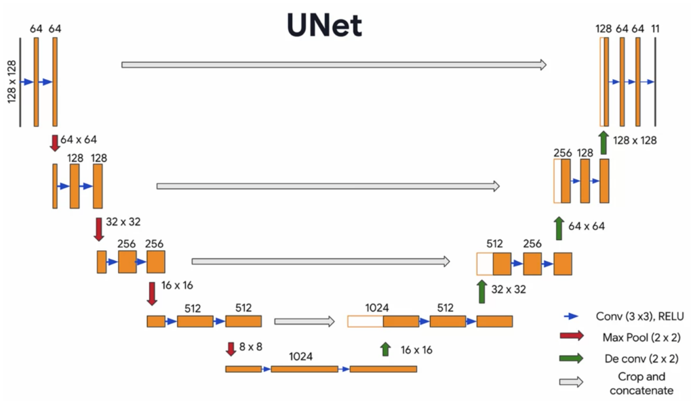
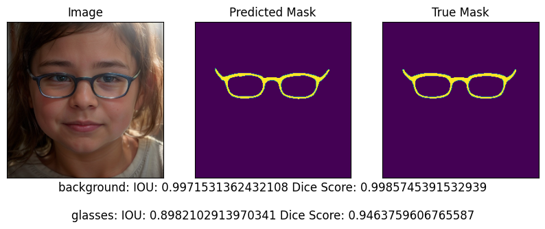
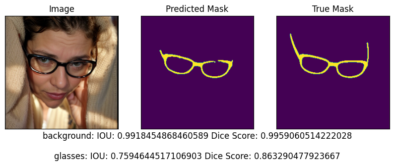
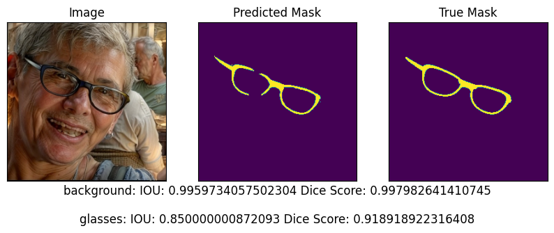
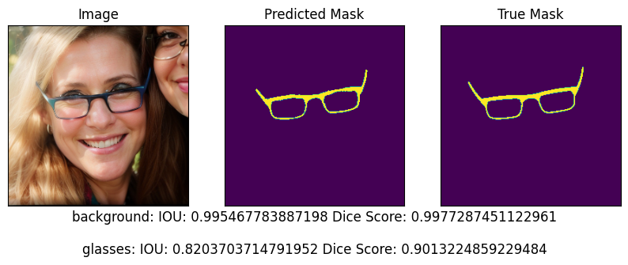
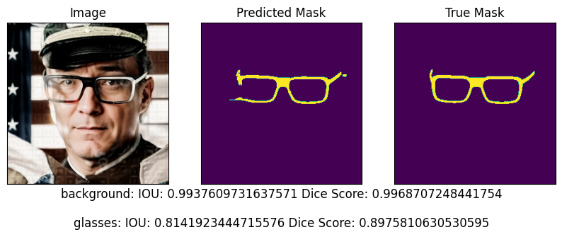
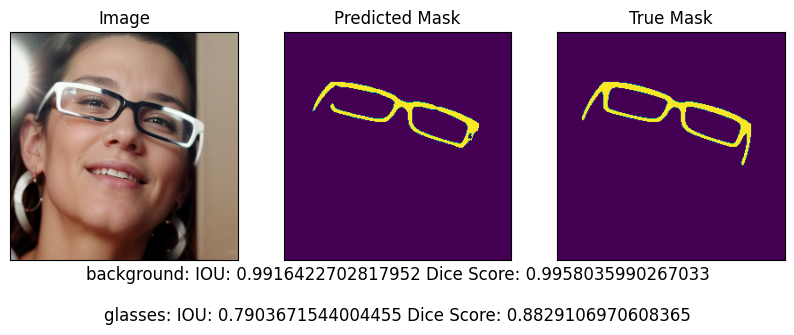
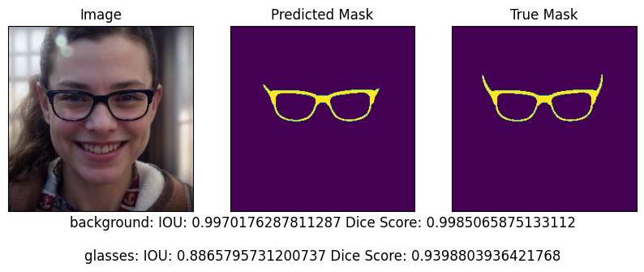
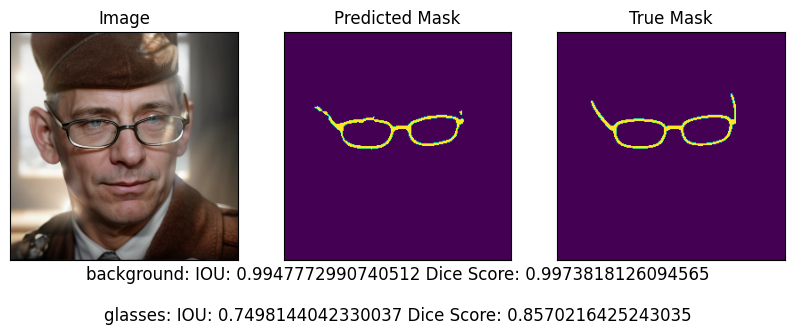
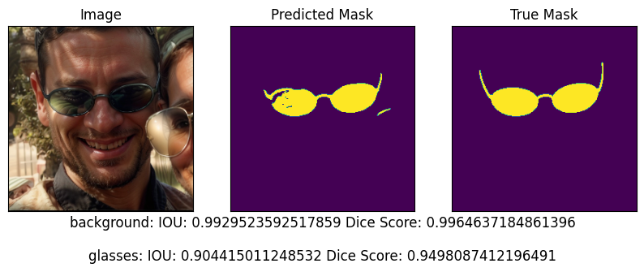

# Glasses Segmentation

The objective is to develop and train a deep learning model to accurately segment eyeglasses in facial images. The training dataset consists of facial images with eyeglasses and segmentation masks. 

## Development

### Dataset processing

The original images were provided with masks images. All of them were resized to 256x256 pixels and normalized. Masks were converted to one-hot encoding.

### Model

For the model architecture, a U-Net was used. This type was chosen because it is known to be effective for image segmentation tasks. The model was implemented using the TensorFlow and Keras libraries. (For more details check the notebook).

The model was trained using the Adam optimizer and sparse_categorical_crossentropy loss. The model was trained for 100 epochs with a batch size of 24. Castom callbacks were used to save the best model and to stop the training if the model does not improve after 6 epochs. 

### Results

The model achieved an accuracy of 0.99 with loss of 0.0118. For each prediction from test set the IOU and dice score was calculated for each class (background and glasses). The IOU and dice score for the glasses class was 0.84 and 0.91 respectively. The IOU and dice score for the background class was 0.99 and 0.99 respectively.

Here are predictions on the test set:

 
 
 
 
 
 
 
 
 

